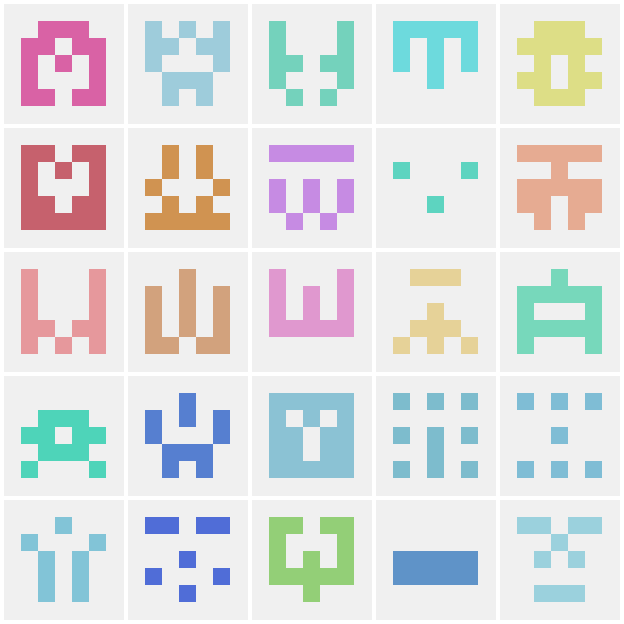

# GitHub Faces

Generate GitHub-style identicons (those colorful 5x5 pixel-art profile pictures).



It can generate **single identicons** (one image from any text input), **collages** (creates grids of multiple identicons). It is **deterministic**, so the same input always produces the same image. Lastly, it is highly **customizable** - you can adjust the size, the padding, and the grid layout.

## Prerequisites

The only dependency it has is the `pillow` library. You can install it via the following command:

```bash
pip install pillow
```

## Quick example

```python
from github_faces import generate_identicon
from collage import create_collage

# Single identicon
img = generate_identicon("username", size=200)
img.save("avatar.png")

# Collage
collage = create_collage(["alice", "bob", "charlie"], cols=3, cell_size=100)
collage.save("team.png")
```

## Usage

Since it can be used in a bunch of different ways, hopefully this section helps you get started.

### Single identicon

```bash
python github_faces.py <text> [output_file] [size]
```

**Examples:**

```bash
# Basic usage (outputs: octocat_identicon.png, 420×420)
python github_faces.py octocat

# Custom filename
python github_faces.py slytebot slytebot.png

# Custom size (200×200)
python github_faces.py "those who observe shall not be left unobserved" hello.png 200
```

### Collage

```bash
python collage.py <output_file> [options] <texts...>
```

**Examples:**

```bash
# From specific names
python collage.py team.png alice bob charlie dave eve

# Random identicons
python collage.py random.png --random 25

# Custom grid: 100 icons, 10 columns, 80px each, 2px gaps
python collage.py grid.png --random 100 --cols 10 --size 80 --padding 2
```

**Options:**

| Flag                  | Default | Description                                       |
| --------------------- | ------- | ------------------------------------------------- |
| `--random N`, `-r N`  | -       | Generate N random identicons                      |
| `--cols N`, `-c N`    | auto    | Number of columns (default: square root of count) |
| `--size N`, `-s N`    | 120     | Size of each identicon in pixels                  |
| `--padding N`, `-p N` | 4       | Gap between identicons                            |

## How it works

GitHub identicons are 5x5 grids with **horizontal mirror symmetry**:

```
┌───┬───┬───┬───┬───┐
│ A │ B │ C │ B │ A │     col 0 mirrors col 4
├───┼───┼───┼───┼───┤     col 1 mirrors col 3
│ D │ E │ F │ E │ D │     col 2 is unique (center)
├───┼───┼───┼───┼───┤
│ G │ H │ I │ H │ G │     15 unique cells determine the pattern
├───┼───┼───┼───┼───┤
│ J │ K │ L │ K │ J │     a half cell is added as padding around the grid
├───┼───┼───┼───┼───┤
│ M │ N │ O │ N │ M │
└───┴───┴───┴───┴───┘
```

**Algorithm:**

1. Hash the input text (lowercased) with MD5 --> output is 16 bytes
2. Use bytes 12-15 to derive an HSL color (pastel range)
3. Use bytes 0-14 to determine which of the 15 cells are filled
4. Mirror the left half to create the symmetric pattern
5. Render with a light gray background and padding

## Limitations

> [!NOTE]
> GitHub's exact algorithm is not publicly documented. This implementation produces **visually similar** identicons but won't pixel-match real GitHub avatars.

GitHub likely hashes an internal user ID, not the username. The exact byte-to-color mapping is unknown.

## License

MIT
